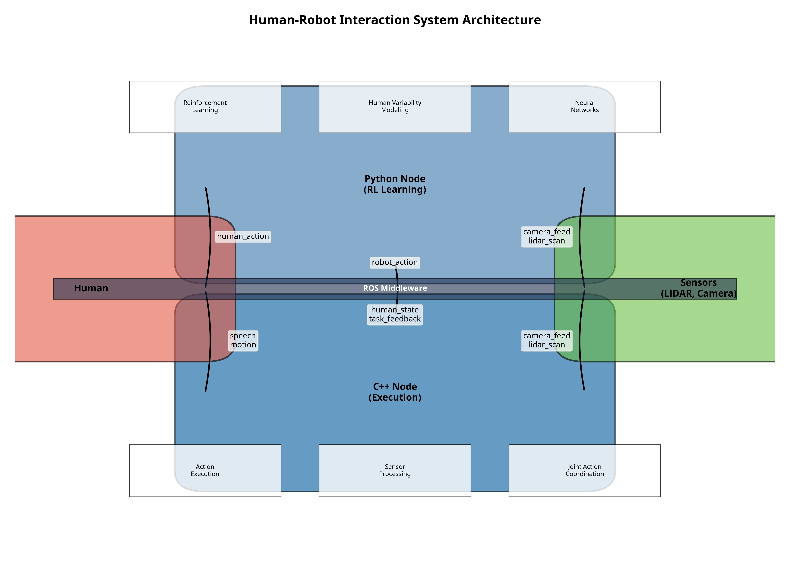
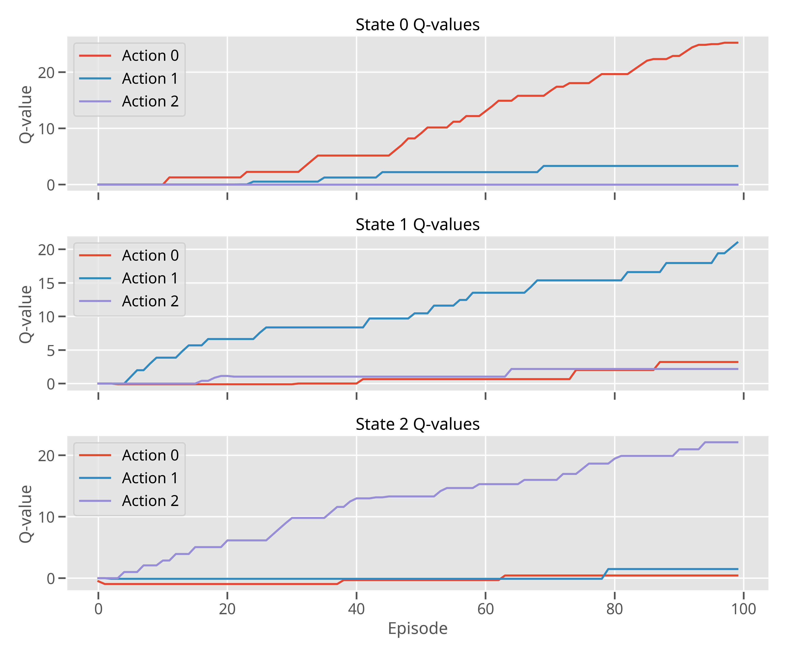
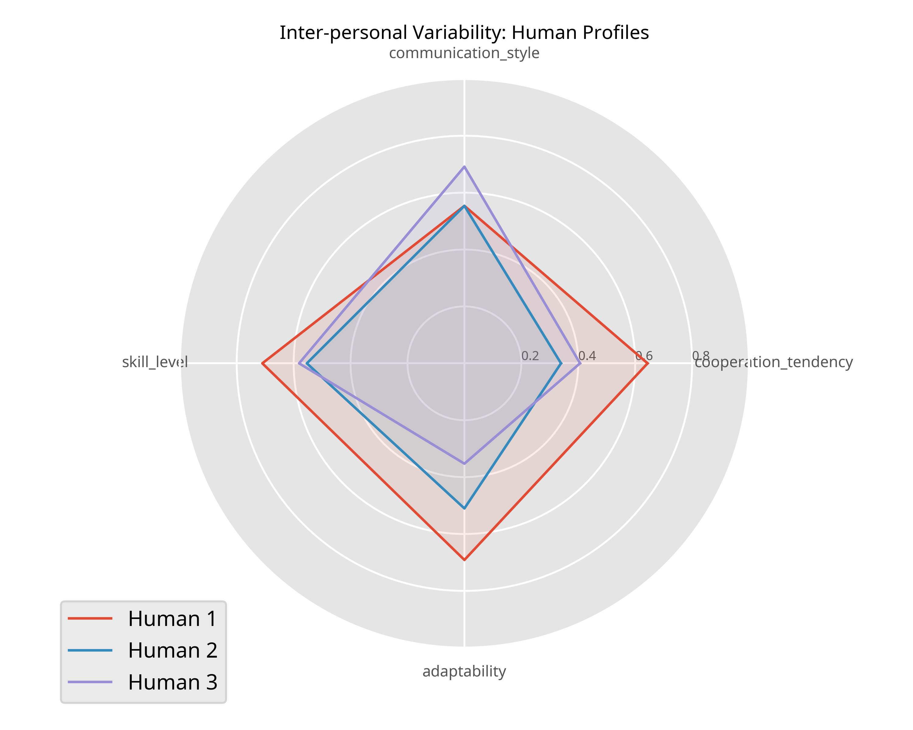
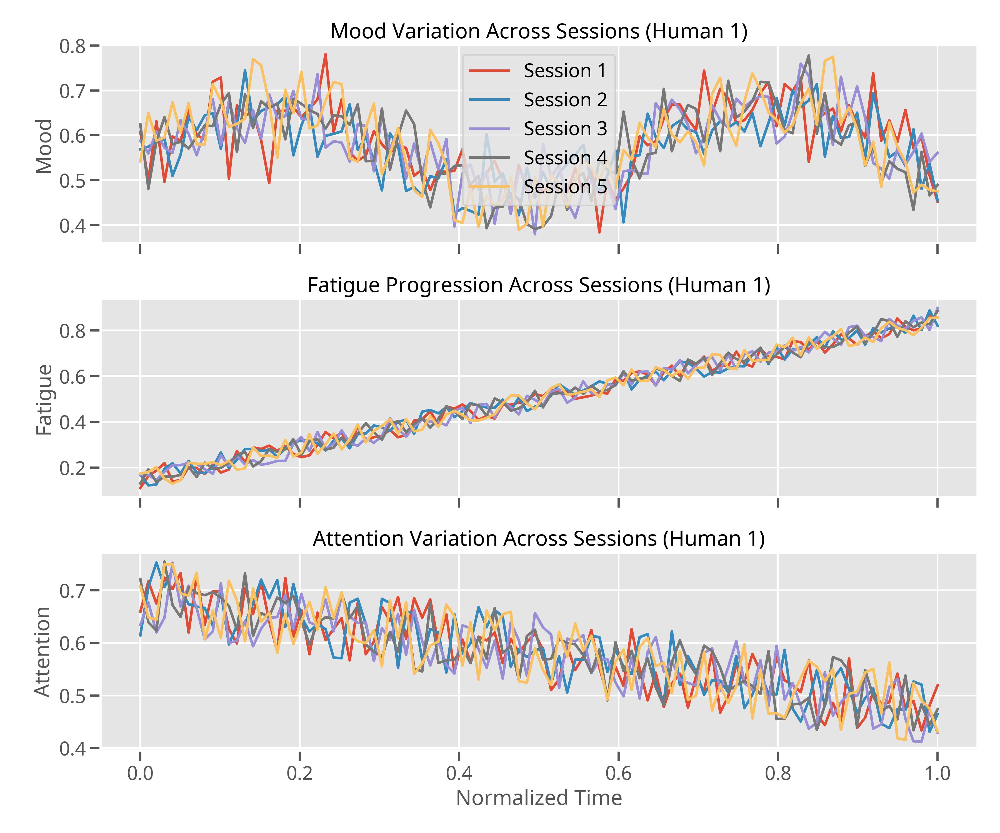
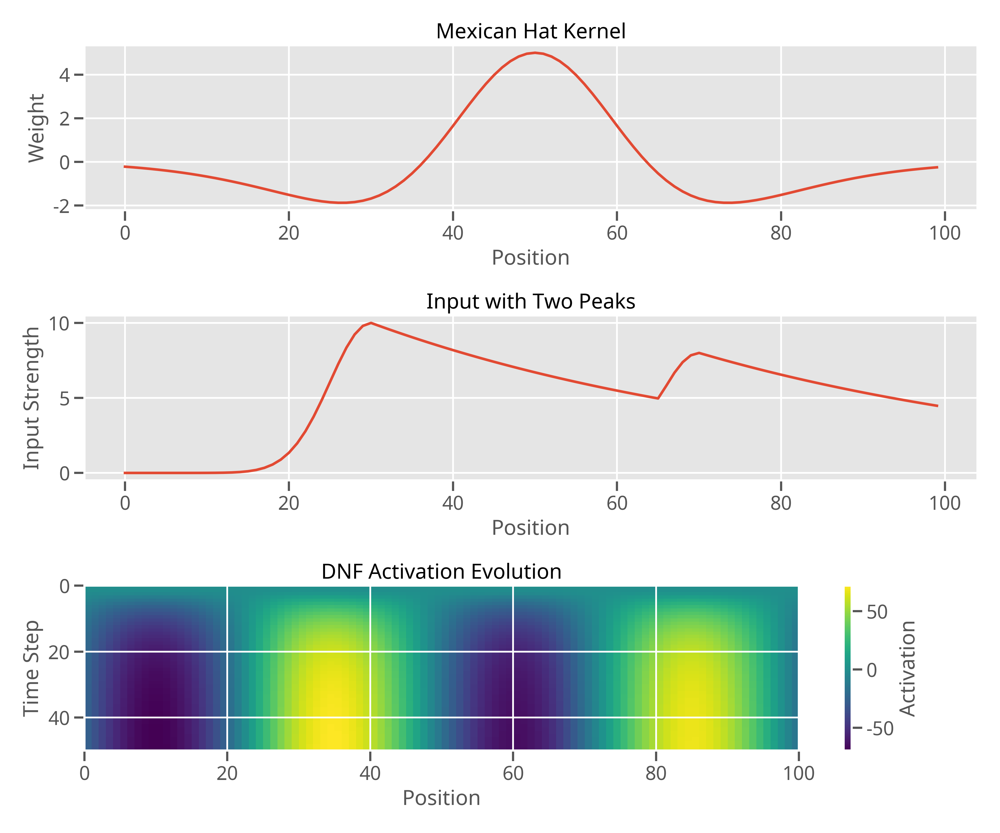
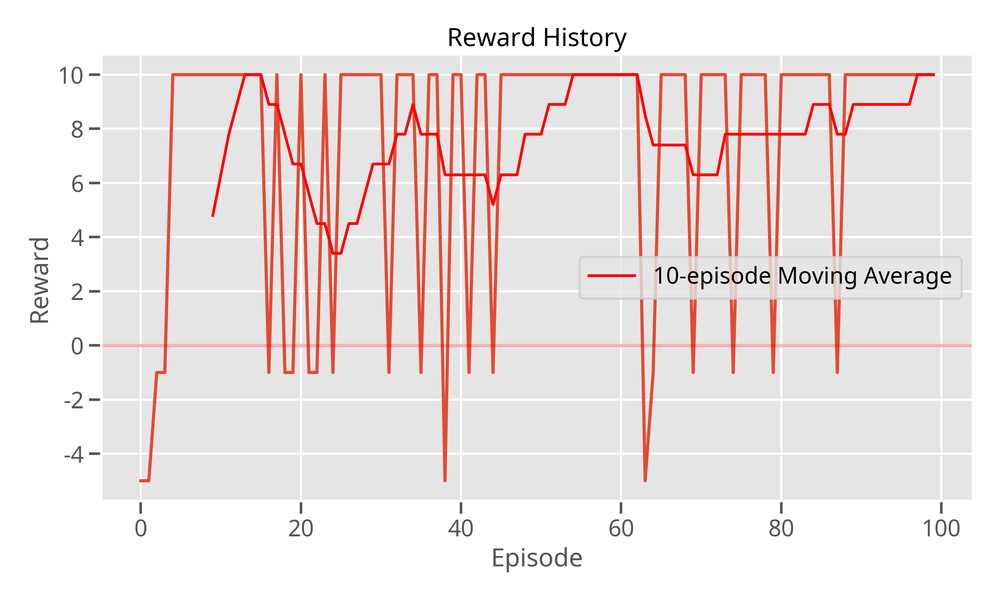
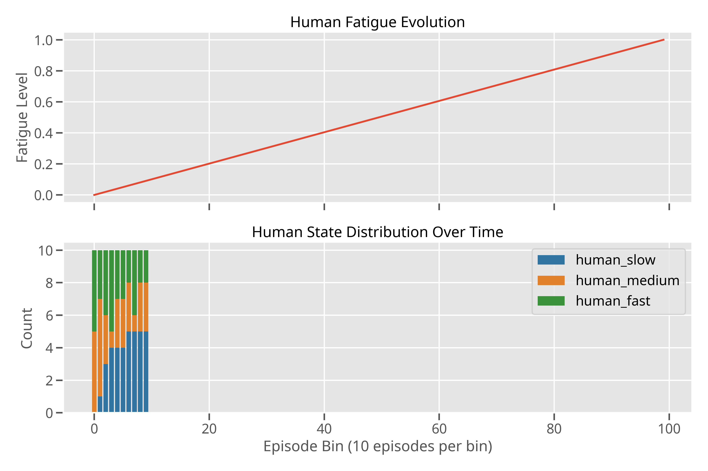

# Eng.Jihad ALKENANI 
# Joint Action Reinforcement Learning with Human Variability

This repository contains an implementation of a human-robot interaction system that models joint action reinforcement learning while accounting for both inter-personal variability (differences between humans) and intra-personal variability (changes within a single human over time).

## Project Overview

This implementation is designed for the PhD project "Modeling joint action reinforcement learning under inter- and intra-personal variability" at LORIA laboratory. The system uses reinforcement learning and neural networks to enable robots to adapt to different human partners and to changes within a single human over time.

### Key Features

- **Joint Action Coordination**: Enables robots to coordinate actions with humans for collaborative tasks
- **Inter-personal Variability Modeling**: Adapts to different human partners with unique characteristics
- **Intra-personal Variability Modeling**: Tracks and adapts to changes in human state over time
- **Dynamic Neural Fields**: Uses biologically-inspired attention modeling based on Amari's equations
- **Reinforcement Learning**: Implements Q-learning with neural networks for adaptive behavior

### Compatible Robots

This implementation is designed to work with various robotic platforms available at LORIA laboratory:

- iCub (IIT) - Humanoid robot for human-robot interaction research
- G1 (Unitree Robotics) - Quadruped robot with advanced mobility
- Tiago (PAL Robotics) - Mobile manipulation platform
- Panda (Franka) - Sensitive robotic arm for precise manipulation
- Pepper (Softbank Robotics) - Humanoid robot for social interaction

## System Architecture

The system consists of two main components:

1. **Python Node**: Handles reinforcement learning and decision-making
2. **C++ Node**: Handles execution and sensor processing

These components communicate through ROS middleware topics:

- `/robot_action`: Python node publishes actions, C++ node subscribes
- `/human_action`: External input to Python node
- `/human_state`: Python node publishes human state data
- `/task_feedback`: C++ node publishes task progress
- `/lidar_scan`, `/camera_feed`: Sensor data



## Implementation Details

### Reinforcement Learning

The system uses Q-learning with neural networks for function approximation, allowing it to learn optimal policies for interacting with humans in different states.

Key components:
- Neural network for Q-function approximation
- Experience replay for stable learning
- Epsilon-greedy policy with decay
- Separate target network for convergence



### Human Variability Modeling

#### Inter-personal Variability

The system models differences between humans using profiles that capture stable traits:
- Cooperation tendency
- Communication style
- Skill level
- Adaptability



#### Intra-personal Variability

The system tracks changes within a single human over time:
- Mood fluctuations
- Fatigue progression
- Attention variations



### Dynamic Neural Fields

The system uses dynamic neural fields based on Amari's equations for attention modeling, allowing it to focus on relevant stimuli while suppressing distractions.



## Code Structure

### Python Node (`src/python_node/human_robot_rl_node.py`)

The Python node handles reinforcement learning and decision-making:

```python
class HumanRobotRLNode:
    def __init__(self):
        # Initialize ROS node
        rospy.init_node("human_robot_rl_node")
        
        # Human variability modeling
        self.human_profiles = {}  # For inter-personal variability
        self.human_state_history = deque(maxlen=50)  # For intra-personal variability
        
        # Create neural network for Q-function approximation
        self.create_q_network()
        
        # Dynamic neural field for attention modeling
        self.dnf_size = 100
        self.dnf_activation = np.zeros(self.dnf_size)
        # ...
```

### C++ Node (`src/cpp_node/robot_execution_node.cpp`)

The C++ node handles execution and sensor processing:

```cpp
class RobotExecutionNode {
private:
    // Human variability model
    HumanVariabilityModel human_model;
    
    // Dynamic neural field for attention
    DynamicNeuralField attention_field;
    
    // Joint action coordinator
    JointActionCoordinator joint_coordinator;
    // ...
```

### Visualization Code (`src/visualization/visualization_code.py`)

The repository includes code for generating visualizations of the system's behavior:

- Dynamic neural field evolution
- Q-learning process
- Human variability modeling
- System architecture

## Results

The system demonstrates successful learning and adaptation to both different humans and changing human states:





## Installation and Usage

### Prerequisites

- ROS Noetic or newer
- Python 3.8 or newer
- C++14 compatible compiler
- TensorFlow 2.x
- NumPy, Matplotlib, Pandas, Seaborn

### Installation

1. Clone this repository into your ROS workspace:
   ```
   cd ~/catkin_ws/src
   git clone https://github.com/jihadalkenani/PhD-Joint-Action-RL.git
   ```

2. Install Python dependencies:
   ```
   pip install tensorflow numpy matplotlib pandas seaborn
   ```

3. Build the ROS package:
   ```
   cd ~/catkin_ws
   catkin_make
   ```

### Running the System

1. Start ROS core:
   ```
   roscore
   ```

2. Launch the Python node:
   ```
   rosrun joint_action_rl human_robot_rl_node.py
   ```

3. Launch the C++ node:
   ```
   rosrun joint_action_rl robot_execution_node
   ```

4. Generate visualizations:
   ```
   python src/visualization/visualization_code.py
   ```


## Acknowledgments

- LORIA Laboratory for the PhD project opportunity
- Amari for the dynamic neural field equations

